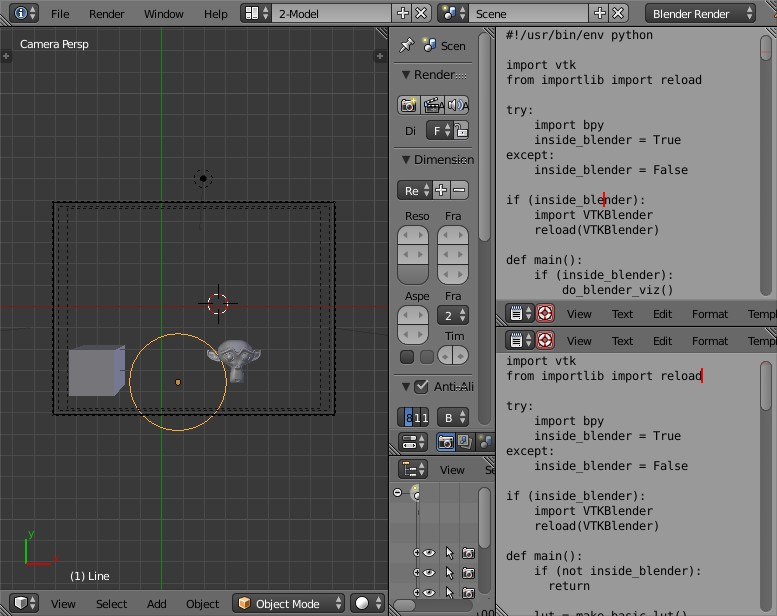
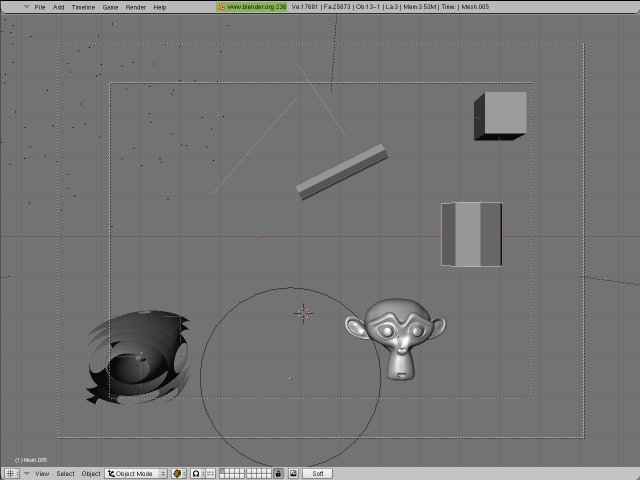
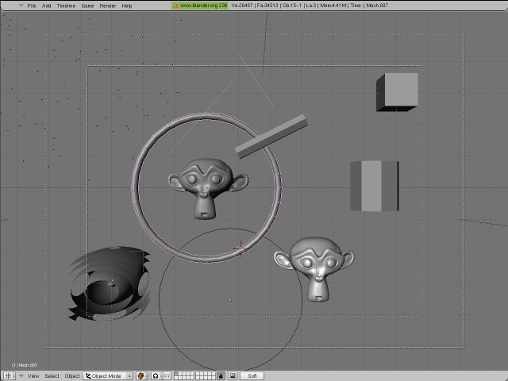
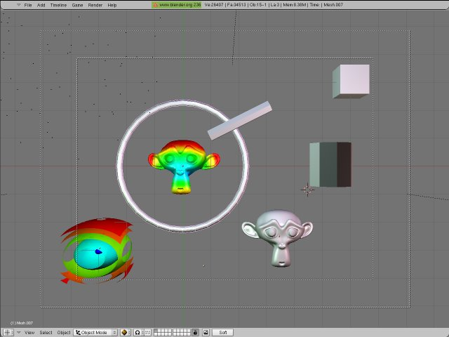
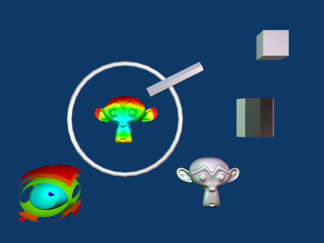
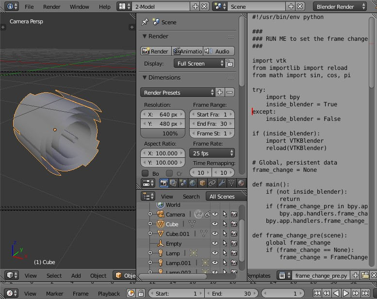
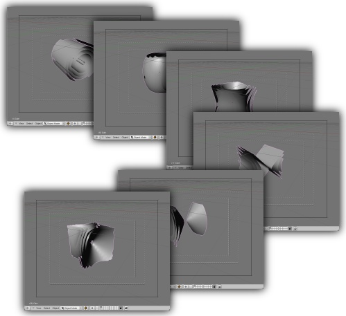
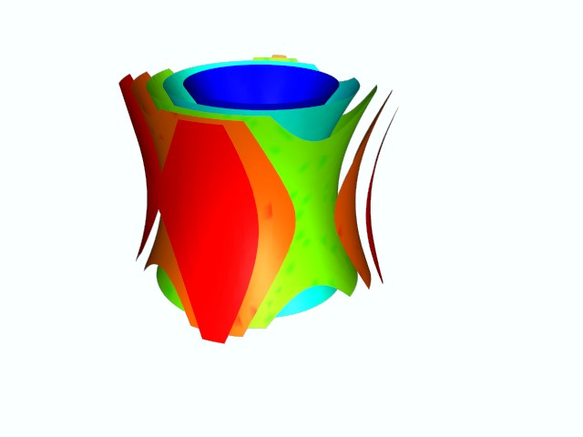
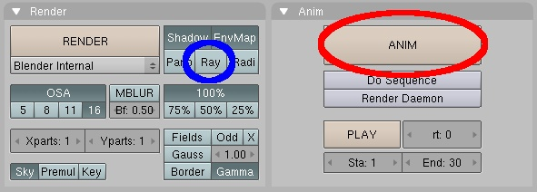
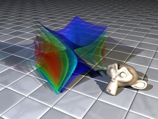

# VTKBlender: VTK and Blender

**Big disclaimer: this code (currently) only works with Blender 2.4x versions, mostly due to an
incompatability between the Python versions used for recent versions of Blender and VTK. This may have
been solved recently, so I hope to find time to update this script for use with modern versions of
Blender.**

## Introduction

The recent increase in popularity of open source software has created some interesting possibilities 
in the realms of computer graphics and scientific visualization. Two great software packages that exploit this
development model are the scientific visualization library [VTK](http://www.vtk.org/) and the 3D modeling, animation,
and rendering package [Blender](http://www.blender.org/).

Can these packages be used together in an almost seamless fashion? Yes, and we will discuss how to do this using
the open source language [Python](http://www.python.org/) as the glue that binds these two powerful pieces of software
together. We will exploit the fact that the VTK libraries have python wrappers, and Blender has a built-in python
interpreter. It should be noted that a complete tutorial for beginners of VTK and Blender would be a huge undertaking,
so it is recommended that the reader has some familiarity already -- check the websites of these projects for
additional documentation.

## Step 1: Get the VTKBlender Module

You can download the python module that makes this all work here: [VTKBlender.py](VTKBlender.py)

Make a note of what directory you save this file in, as we will need this information in the next step.

## Step 2: Getting Blender to find the VTK libraries and the VTKBlender module

Blender's python interpreter needs to find the VTK modules and the VTKBlender module in order to work
successfully. There are two ways to help python to find these modules: and you can either 1) set your `PYTHONPATH`
in your environment, or you can 2) hard code the locations in your script using the `sys.path` variable, e.g.,

1. We are assuming a UNIX environment, so Windows users might want to consult some additional documentation on
   how to set python related environment variables.

   For Bourne compatible shells, at the prompt, before starting blender, type:

   ```
   PYTHONPATH=$VTK_ROOT/Wrapping/Python:${LIBRARY_OUTPUT_PATH}
   PYTHONPATH=$PYTHONPATH:${PATH_TO_VTKBlender_MODULE}
   export PYTHONPATH
   ```
   
   For csh compatible shells, at the prompt, before starting blender, type:

   ```
   setenv PYTHONPATH $VTK_ROOT/Wrapping/Python:${LIBRARY_OUTPUT_PATH}
   setenv PYTHONPATH ${PYTHONPATH}:${PATH_TO_VTKBlender_MODULE}
   ```
   You may want to add these commands to your shell's startup scripts.

2. add the following to your script near the beginning, before importing VTK or VTKBlender:

   ```python
   import sys
   sys.path.append($VTK_ROOT/Wrapping/Python)
   sys.path.append(${LIBRARY_OUTPUT_PATH})
   sys.path.append(${PATH_TO_VTKBlender_MODULE})
   ```
   
   Be sure to replace `$VTK_ROOT` and `${LIBRARY_OUTPUT_PATH}` with values that are relevant to your system.
   These values can be found by starting `vtkpython` with no arguments and typing:

   ```python
   import sys
   print sys.path
   ```
   
   Usually the first two items reported are the ones you want.

   Also replace `${PATH_TO_VTKBlender_MODULE}` with wherever you have put the VTKBlender module.

## What does the VTKBlender python module do?

The VTKBlender module converts vtkPolyDataMapper's to blender meshes and converts blender meshes to vtkPolyData.
There are two python functions that do these conversions:

* **`VTKBlender.PolyDataMapperToBlender(pmapper, me=None)`**
  If the function is run with only one argument, this function takes a vtkPolyDataMapper pmapper
  and returns a new blender mesh with the converted polydata. A second optional argument, which takes a
  pre-existing blender mesh, may be provided, causing the existing mesh to be overwritten with the polydata.
  Please note that the new mesh is not added to the scene, and can be added afterwards via:

  ```python
  sc = Blender.Scene.GetCurrent()
  ob = Blender.Object.New('Mesh')
  ob.link(me)
  sc.objects.link(ob)
  ```
  
  The reason why the function takes a vtkPolyDataMapper object as an argument (instead of a vtkPolyData object)
  is because the vtkPolyDataMapper can also contain a look up table to color the data, in which case the blender
  mesh will have vertex colors set accordingly.

* **`VTKBlender.BlenderToPolyData(me, uvlayer=None)`**
  This function take a blender mesh and returns a vtkPolyData object that contains the geometry contained in the mesh.
  If UV coordinates exist they will be exported. The name of a UV layer can be used as an optional argument to export
  a particular UV layer. The active layer will be exported if no layer is specified, so for example if the mesh has
  only one UV layer, that layer will be exported without using the optional argument.

## Examples

### Example 1

Let's test that the VTKBlender actually works by running an example file:

[VTKBlender_demo.blend](assets/VTKBlender_demo.blend)

Load this file into blender. In the main 3D window, you will see a cube, a ring, and a monkey head.
Below this you will see some buttons. On the right part of the screen you will see two text editors with
python scripts, the top one called **vtk_to_blender.py** and the other called **blender_to_vtk.py**.



#### Example 1a

Lets try running the top script, **vtk_to_blender.py**. The main purpose of this script is to demonstrate how
the **VTKBlender.PolyDataMapperToBlender()** function can be used to get different kinds of geometry created with vtk
into blender. With your mouse cursor in the top script sub-window, press Alt-P to run the script, or select 
"Run Python Script" from that window's file menu.

The script will create some points, some lines, a tube, a cube, a cylinder, and the familiar quadric isosurface
from the VTK examples. Notice how the cube actually turns into the quadric isosurfaces: this is an example of
**VTKBlender.PolyDataMapperToBlender()** being passed the cube mesh as an argument, thus overwriting the cube's mesh.



The other thing that is of interest with this script is that it has some code to detect whether it is running
inside of blender or not, and if it determines that it is not running inside blender, it will call the VTK library
to render the objects created. In the script window's File menu, select save to write the script to an external text
file and try it for yourself!

#### Example 1b

The next example shows interaction between VTK and Blender in the opposite direction:
geometry created in blender (the monkey head) will be passed to VTK, run through a probe filter to color it
(using the quadric scalar field) and returned to the blender scene as a new object. At the same time,
the ring object will be passed to VTK, run through a tube filter, and returned to blender. Place your mouse cursor
in the bottom text window and press Alt-P to run the script.



Where are the colors? Lets switch to shaded mode to see them (press Shift-Z with your mouse cursor in the 3D window to
switch display modes).



We can then render this scene with blender's scanline renderer to produce the following image:



Hmmm, that doesn't look like a particularly impressive render! Blender has a built in scanline render and a
build in raytracer, and has support to use the external YAFRay raytracer. In the right hands, Blender can make some
very impressive images, of which the above image is not. We'll do something a bit more fancy in the next example,
but in the meantime, check out the Blender website gallery archive to see why Blender is an excellent choice
for 3D Graphics:

http://archive.blender.org/features-gallery/gallery/

### Example 2

In this example we will use Blender to animate and render a visualization created in VTK.

Download the example file here:

[VTKBlender_demo2.blend](assets/VTKBlender_demo2.blend)



The magic that runs this example is something called scriptlink-ing. This is the ability to have Blender
run a python script when an event occurs.


Scriptlinks are set up in the scriptlink window. Here we have created a FrameChanged scriptlink:
we are telling Blender that we would like the script anim.py to be executed every time the frame changes.
To see the effect of anim.py, change the frame using the left or right arrow keys or watch the scene being
animated by pressing Alt-A when the mouse pointer is in the 3D window.



The script anim.py creates the VTK pipeline the first time it is run, creating some isosurfaces in a field
generated from a vtkQuadric object. On subsequent invocations the parameters of the quadric filter are
modified based on the frame number, and new isosurfaces are created. A special module called Blender.Registry is
used to preserve data between script invocation so that we don't have to constantly recreate our pipeline.

We can use the scanline renderer to render individual frames, or we can create a 30 frame animation by pressing
the Anim button.



OK, do you remember in the last example when I said we would be doing something more fancy? Well, here it is:
press the 2 key with your mouse pointer in the 3D Window to reveal the hidden layer number 2, enable the raytracer
with the Ray button, and press Anim.



We are going to be raytracing so I hope you have a lot of spare CPU time! If you wait long enough,
the final result will look something like this (click to download an mpeg of the animation, let the animation
loop in your viewer):

[](assets/blender-vtk.mpg)

That should be enough to get people started using VTK and Blender together. To get full use of VTK and Blender,
refer to the corresponding websites to download or purchase additional documentation:

* http://www.vtk.org
* http://www.blender.org

Have fun!

## Notes
* **2017-04-17**: Moved this code to GitHub
* **2008-07-03**: Jon Crall from Kitware requested access to UV coordinates so that he could use the models from
  [Big Buck Bunny](http://www.bigbuckbunny.org/) in VTK. The function BlenderToPolyData() now will export UV coords
  if they exist, and has an optional argument to specify the UV layer (the active layer will be used if no argument
  is supplied). The code, examples, and documentation have also been updated to reflect the new Blender API syntax for linking objects to scenes: scene.link(object) is now supposed to be scene.objects.link(object).
* **2006-08-23**: Some bugfixes and speedups -- thanks to Fritz Mielert from the University of Stuttgart for his valuable
  feedback!
* **2006-07-11**: The VTKBlender.py module and the demos have been updated for VTK 5.x and for Blender 2.41 and later.
  These new versions no longer uses the Blender 'NMesh' module to manupulate meshes, and instead uses the new 'Mesh'
  module for faster access.
